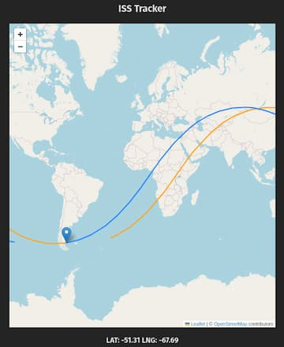

# Mission Control - ISS Tracker

<p align="center">
  
</p>

Track the location of the International Space Station.

Built with React, Typescript and Vite.

## How it works

The location of the ISS is determined from its [Two-line element set](https://en.wikipedia.org/wiki/Two-line_element_set) (TLE).

```
ISS (ZARYA)
1 25544U 98067A   13080.79204657  .00024647  00000-0  40606-3 0  4540
2 25544  51.6478 182.2316 0011718  59.7125  80.2831 15.52100765821132
```

The TLE data is fetched from [whertheiss.at](https://wheretheiss.at/w/developer)
